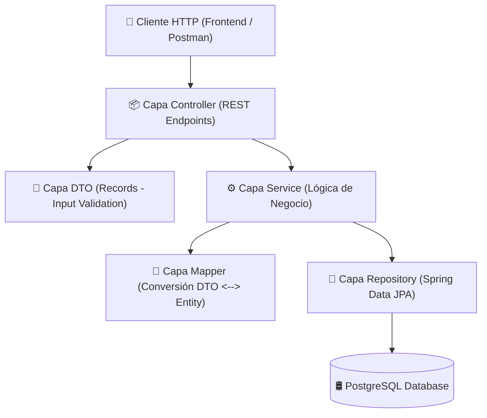

# 🛒 inventario-abarrote-api

[](https://spring.io/projects/spring-boot)
[](https://jdk.java.net/21/)
[](https://www.postgresql.org/)
[](https://maven.apache.org/)
[](https://projectlombok.org/)

Un motor de backend moderno y eficiente para el control de inventario de tiendas de abarrotes (minimarkets, bodegas, supermercados). Desarrollado con **Java 21**, **Spring Boot 3.5**, **Spring Data JPA** y **PostgreSQL**, este sistema implementa lógicas de control de lotes y trazabilidad mediante **Kardex** bajo el enfoque arquitectónico REST.

---

## 🏗️ Arquitectura y Flujo del Sistema

El proyecto sigue una arquitectura multicapa estándar en el ecosistema Spring, promoviendo el acoplamiento débil y la alta cohesión:



### Flujo de Datos en el Ingreso de Mercancía:
1. El cliente envía un payload de tipo `IngresoMercanciaRequestDTO`.
2. El controller valida las reglas sintácticas (`@NotNull`, `@Min`, `@DecimalMin`, `@Future`).
3. El service busca en la base de datos que el **Producto** y **Proveedor** existan.
4. Se crea un **Lote** físico con fecha de vencimiento, costo unitario y cantidad inicial/actual.
5. Se crea y registra una transacción en el **Kardex** de tipo `ENTRADA` vinculada a ese lote.
6. Se devuelve un `IngresoMercanciaResponseDTO` limpio y plano al cliente.

---

## 📂 Estructura del Proyecto

A continuación se detalla la distribución de paquetes en `src/main/java/com/cibertec/inventario`:

```text
📂 inventario
 ┣ 📂 controller      # Controladores REST que exponen los endpoints HTTP
 ┣ 📂 dto             # Objetos de Transferencia de Datos (Java Records con validaciones)
 ┣ 📂 entity          # Entidades persistentes mapeadas con JPA / Hibernate
 ┣ 📂 exception       # Manejadores de excepciones y errores personalizados
 ┣ 📂 mapper          # Mapeadores para transformar Entidades a DTOs y viceversa
 ┣ 📂 repository      # Interfaces que extienden de JpaRepository para acceso a datos
 ┣ 📂 service         # Clases de servicio donde reside la lógica de negocio
 ┗ 📜 InventarioAbarroteApplication.java  # Clase principal (punto de entrada)
```

---

## 🛢️ Modelo de Base de Datos y Entidades

El diseño relacional se compone de 5 entidades principales. Todas usan **UUID** autogenerados como claves primarias para mayor seguridad y escalabilidad en sistemas distribuidos.

```mermaid
erDiagram
    CATEGORIA ||--o{ PRODUCTO : clasifica
    PRODUCTO ||--o{ LOTE : "tiene existencias"
    PROVEEDOR ||--o{ LOTE : "abastece"
    PRODUCTO ||--o{ KARDEX : "registra movimientos"
    LOTE ||--o? KARDEX : "detalla movimiento"

    CATEGORIA {
        uuid id PK
        varchar nombre UK
        varchar descripcion
    }
    PRODUCTO {
        uuid id PK
        varchar codigo_barras UK
        varchar nombre
        decimal precio_venta
        integer stock_minimo
        uuid categoria_id FK
    }
    PROVEEDOR {
        uuid id PK
        varchar razon_social UK
        varchar contacto
        varchar telefono
    }
    LOTE {
        uuid id PK
        uuid producto_id FK
        uuid proveedor_id FK
        date fecha_vencimiento
        decimal costo_unitario
        integer cantidad_inicial
        integer cantidad_actual
        timestamp fecha_ingreso
    }
    KARDEX {
        uuid id PK
        uuid producto_id FK
        uuid lote_id FK
        varchar tipo_movimiento
        integer cantidad
        varchar motivo
        timestamp fecha_movimiento
    }
```

### Detalle Técnico de Entidades

1. **`Categoria`**: Clasificación lógica de productos (Ej: "Lácteos", "Bebidas"). Evita duplicados mediante restricción `unique` en el nombre.
2. **`Producto`**: Contiene la definición del producto, código de barras único para escaneo físico, precio de venta con precisión monetaria (`10,2`), stock mínimo permitido y relación con una Categoría.
3. **`Proveedor`**: Registra los datos de contacto y la razón social única de las empresas proveedoras de mercancía.
4. **`Lote`**: Entidad fundamental para el control de inventario. Registra los costos unitarios de compra y las existencias restantes de cada lote específico, ordenados bajo criterio **FEFO (First Expired, First Out)** para priorizar la salida de productos con vencimiento más cercano.
5. **`Kardex`**: Historial inmutable de movimientos. Clasifica transacciones bajo el tipo de movimiento (`ENTRADA`, `SALIDA_VENTA`, `SALIDA_MERMA`, `AJUSTE`).

---

## 🚀 Endpoints de la API (v1)

### 1. Categorías (`/api/v1/categorias`)

* **`POST /api/v1/categorias`** - Crear categoría:
  * **Request Body (`CategoriaRequestDTO`)**:
    ```json
    {
      "nombre": "Bebidas y Licores"
    }
    ```
  * **Response (201 Created)**:
    ```json
    {
      "id": "e4b2d9a1-8d2a-4a6f-b2c8-8dfbc54b9f21",
      "nombre": "Bebidas y Licores"
    }
    ```

* **`GET /api/v1/categorias`** - Listar todas las categorías.
* **`GET /api/v1/categorias/{id}`** - Obtener categoría por su ID (UUID).

---

### 2. Proveedores (`/api/v1/proveedor`)

* **`POST /api/v1/proveedor`** - Crear proveedor:
  * **Request Body (`ProveedorRequestDTO`)**:
    ```json
    {
      "razonSocial": "Distribuidora Abarrotes del Norte S.A.C.",
      "contacto": "Juan Pérez",
      "telefono": "+51987654321"
    }
    ```
  * **Response (201 Created)**:
    ```json
    {
      "id": "7bf31a89-2d12-40c2-9e90-2bf7f5e18239",
      "razonSocial": "Distribuidora Abarrotes del Norte S.A.C.",
      "contacto": "Juan Pérez",
      "telefono": "+51987654321"
    }
    ```

* **`GET /api/v1/proveedor`** - Listar todos los proveedores.
* **`GET /api/v1/proveedor/{id}`** - Obtener proveedor por su ID (UUID).

---

### 3. Productos (`/api/v1/productos`)

* **`POST /api/v1/productos`** - Crear un producto:
  * **Request Body (`ProductoRequestDTO`)**:
    ```json
    {
      "codigoBarras": "7750102030405",
      "nombre": "Leche Evaporada Entera 400g",
      "precioVenta": 4.50,
      "stockMinimo": 24,
      "categoriaId": "e4b2d9a1-8d2a-4a6f-b2c8-8dfbc54b9f21"
    }
    ```
  * **Response (201 Created)**:
    ```json
    {
      "id": "a90184fa-bc39-4d87-99e2-9b2eeadfc903",
      "codigoBarras": "7750102030405",
      "nombre": "Leche Evaporada Entera 400g",
      "precioVenta": 4.50,
      "stockMinimo": 24,
      "categoriaId": "e4b2d9a1-8d2a-4a6f-b2c8-8dfbc54b9f21",
      "categoriaNombre": "Bebidas y Licores"
    }
    ```

* **`GET /api/v1/productos`** - Listar todos los productos con datos de su categoría.
* **`GET /api/v1/productos/{id}`** - Obtener producto detallado por su ID.

---

### 4. Inventario y Control de Kardex (`/api/v1/inventario`)

* **`POST /api/v1/inventario/ingresos`** - Registrar ingreso de mercancía:
  * **Lógica interna**: Valida que la fecha de vencimiento sea futura. Registra las existencias en `lotes` y añade la transacción en `kardex` como `ENTRADA`.
  * **Request Body (`IngresoMercanciaRequestDTO`)**:
    ```json
    {
      "productoId": "a90184fa-bc39-4d87-99e2-9b2eeadfc903",
      "proveedorId": "7bf31a89-2d12-40c2-9e90-2bf7f5e18239",
      "cantidad": 120,
      "costoUnitario": 3.20,
      "fechaVencimiento": "2027-08-30"
    }
    ```
  * **Response (201 Created)**:
    ```json
    {
      "kardexId": "df1230ab-8891-4c12-b9cf-227bf099d0e1",
      "loteId": "ffaa8421-2e90-482a-a92c-88ab9d871212",
      "productoNombre": "Leche Evaporada Entera 400g",
      "cantidad": 120,
      "costoUnitario": 3.20,
      "fechaMovimiento": "2026-05-28T03:45:00"
    }
    ```

---

## 🛠️ Configuración y Ejecución del Proyecto

### Requisitos Previos
* **Java Development Kit (JDK) 21** o superior instalado.
* **Maven 3.9+** (o usar el wrapper `./mvnw` incluido).
* **Docker y Docker Compose** (opcional, para levantar la base de datos fácilmente).
* **PostgreSQL** en ejecución local o remota (si no se usa Docker).

### 1. Configuración de Base de Datos

#### Opción A: Usando Docker Compose (Recomendado)
El proyecto incluye un archivo [docker-compose.yml](file:///C:/Users/ronny/Documents/Projects/Backend/inventario-abarrote-api/docker-compose.yml) listo para levantar un contenedor con PostgreSQL 16:

```bash
docker compose up -d
```

Esto iniciará automáticamente una base de datos PostgreSQL llamada `inventario_abarrote_db` en el puerto `5432` con las credenciales por defecto configuradas en el proyecto:
* **Usuario:** `admin`
* **Contraseña:** `admin123`

#### Opción B: PostgreSQL Local
Si prefieres usar una instalación local de PostgreSQL:
1. Crea una base de datos llamada `inventario_abarrote_db`.
2. Asegúrate de que las credenciales de conexión coincidan con las configuradas en [application.yaml](file:///C:/Users/ronny/Documents/Projects/Backend/inventario-abarrote-api/src/main/resources/application.yaml).

Las credenciales actuales configuradas en [application.yaml](file:///C:/Users/ronny/Documents/Projects/Backend/inventario-abarrote-api/src/main/resources/application.yaml) son:
```yaml
spring:
  datasource:
    url: jdbc:postgresql://localhost:5432/inventario_abarrote_db
    username: admin
    password: admin123
  jpa:
    hibernate:
      ddl-auto: update
    show-sql: true
```

*Nota: La configuración `ddl-auto: update` generará y actualizará automáticamente las tablas en el primer arranque del servidor sin necesidad de ejecutar scripts manuales.*

### 2. Compilar el Proyecto
Ejecuta el siguiente comando para limpiar el directorio de build y compilar las dependencias del proyecto:
```bash
./mvnw clean compile
```

### 3. Ejecutar la Aplicación
Para levantar el servidor embebido Tomcat (por defecto en el puerto `8080`):
```bash
./mvnw spring-boot:run
```

Una vez levantado el servidor, la API estará lista para escuchar peticiones en `http://localhost:8080`.

### 4. Ejecutar Pruebas
Para correr los tests unitarios y de integración configurados:
```bash
./mvnw test
```

---

## 💎 Características Destacadas y Buenas Prácticas

* **Manejo Global de Excepciones**: Implementado a través de [GlobalExceptionHandler](file:///C:/Users/ronny/Documents/Projects/Backend/inventario-abarrote-api/src/main/java/com/cibertec/inventario/exception/GlobalExceptionHandler.java), centralizando la captura de errores en la API. Transforma fallos de lógica de negocio o errores de validación sintáctica en respuestas estandarizadas usando el record [ErrorResponseDTO](file:///C:/Users/ronny/Documents/Projects/Backend/inventario-abarrote-api/src/main/java/com/cibertec/inventario/dto/ErrorResponseDTO.java), el cual provee estructura con mensajes detallados y marcas de tiempo (`timestamp`).
* **Configuración de CORS**: Habilitado a través de [CorsConfig](file:///C:/Users/ronny/Documents/Projects/Backend/inventario-abarrote-api/src/main/java/com/cibertec/inventario/config/CorsConfig.java) para permitir la comunicación fluida con clientes frontend (por ejemplo, aplicaciones Angular corriendo en `http://localhost:4200`). Permite mapeo de rutas bajo `/api/v1/**` con soporte completo para verbos HTTP como `GET`, `POST`, `PUT`, `DELETE` y pre-flights `OPTIONS`.
* **Contenedorización con Docker**: Configuración del entorno de base de datos automatizado mediante [docker-compose.yml](file:///C:/Users/ronny/Documents/Projects/Backend/inventario-abarrote-api/docker-compose.yml), asegurando consistencia y facilidad de despliegue local para el motor de PostgreSQL.
* **Java Records**: Uso de `record` para todos los DTOs, garantizando inmutabilidad y reduciendo la complejidad del código.
* **Validación Declarativa (Jakarta Validation)**: Validación robusta a nivel de API para evitar datos incoherentes (por ejemplo, precios menores a cero, nombres vacíos o fechas de expiración en el pasado).
* **Preparación para FEFO**: Contiene consultas optimizadas preparadas en el [LoteRepository](file:///C:/Users/ronny/Documents/Projects/Backend/inventario-abarrote-api/src/main/java/com/cibertec/inventario/repository/LoteRepository.java) para priorizar lotes próximos a vencer a la hora de procesar ventas o salidas de mercadería:
  ```java
  @Query("SELECT l FROM Lote l WHERE l.producto.id = :productoId AND l.cantidadActual > 0 ORDER BY l.fechaVencimiento ASC")
  List<Lote> findLotesConStockPorProducto(@Param("productoId") UUID productoId);
  ```
* **Lombok**: Simplifica los modelos de entidades persistentes con anotaciones de constructores y getters sin añadir ruido al código de negocio.
* **Control de Transacciones**: Uso estricto de `@Transactional` para garantizar la consistencia en base de datos al realizar operaciones que impactan múltiples tablas (como el ingreso de stock que graba lote y movimiento de kardex a la vez).
